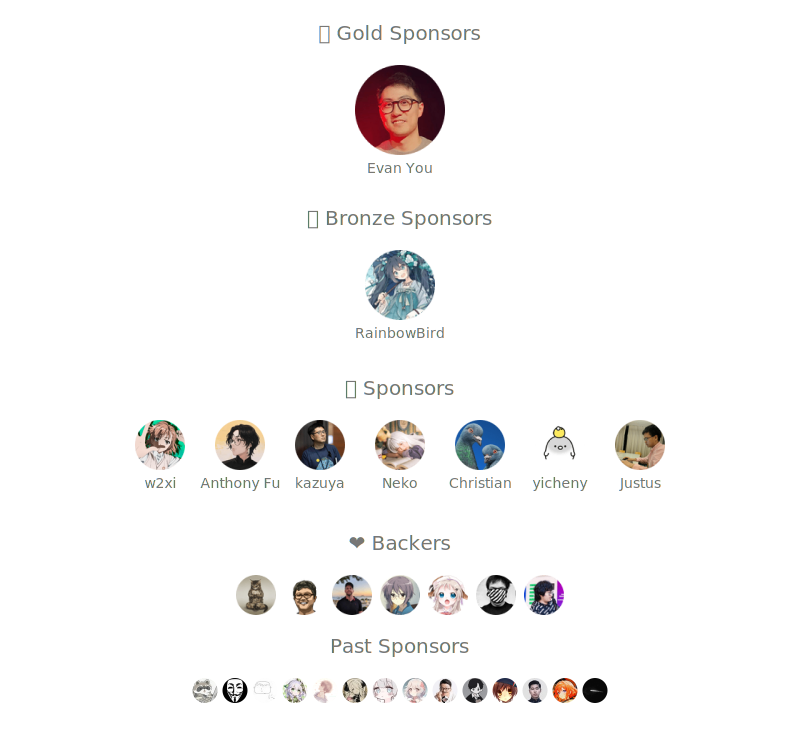

## Sponsors

If my code has helped you, please consider [sponsoring me](https://github.com/sponsors/LittleSound).

-  [GitHub Sponsor](https://github.com/sponsors/LittleSound)
<!-- -  Ethereum, Polygon: [xxx.eth](https://etherscan.io/address/xxxx) -->
<!-- - [Stripe](https://donate.stripe.com/xxx) -->
<!-- - [爱发电](https://afdian.com/a/xxx) -->

Thank you for your support!

## Doc

- [中国大陆用户指南 / Chinese Guide](./doc/chinese-guide.md)

## Contact

<!-- - Telegram: [@xxx](https://t.me/xxx) -->
- Twitter: [@OikawaRizumu](https://x.com/OikawaRizumu)

  

## Thanks

Built with [SponsorKit](https://github.com/antfu/sponsorkit).

Reference from [sxzz/sponsors](https://github.com/sxzz/sponsors?tab=readme-ov-file).
